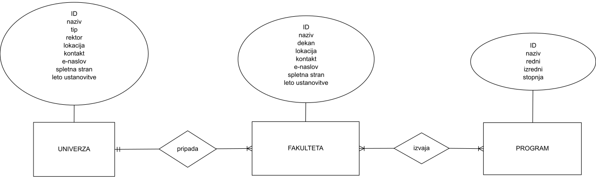

# Slovenske fakultete
Avtorja: Denis Benčič in Hana Kranjec Kelbel

V bazi bi zbrala osnovne podatke o slovenskih fakultetah.

Bazo bi sestavljale tabele univerza, fakulteta in program, ki bi bile med seboj povezane.
V prvi bi hranila osnovne podatke o univerzah kot npr. kraj, leto ustanovitve, rektor, število študentov, tip univerze (javna, zasebna, mednarodna) ipd.
V drugi bi hranila osnovne podatke o fakultetah npr. naslov, leto ustanovitve, dekan, razne telefonske številke, spletna stran ipd.
V tretji bi hranila podatke o izvajanih programih fakultet npr. stopnja, tip programa (redni ali izredni, univerziteni ali visokošolski), trajanje ipd.
V četrti bi hranila podatke o izvajanih predmetih programov npr. število ECTS točk, število izvajanih ur, izvajalci ipd.

Podatke bi pridobila s spletnih strani unverz ter fakultet. Kot uporabna vira bi služila tudi Studentski.net ter Wikipedia.

Glavni namen in funkcionalnost baze bi bil hiter dostop in poizvedovanje do vseh podatkov na enem mestu, ki bi jih (bodoči) študentje, starši in osebje morda potrebovali.

Trenutno gre zgolj za osnovno idejo, ki se bo morda spremenila tekom ustvarjanja.

